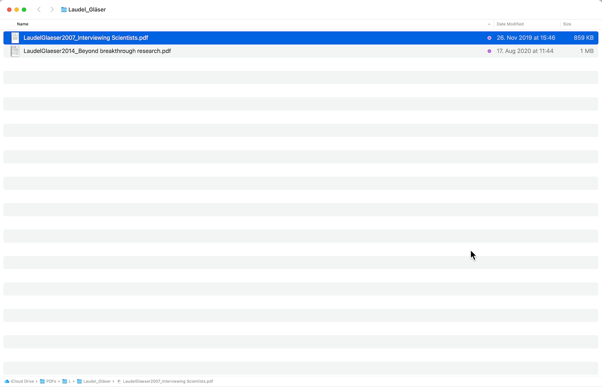
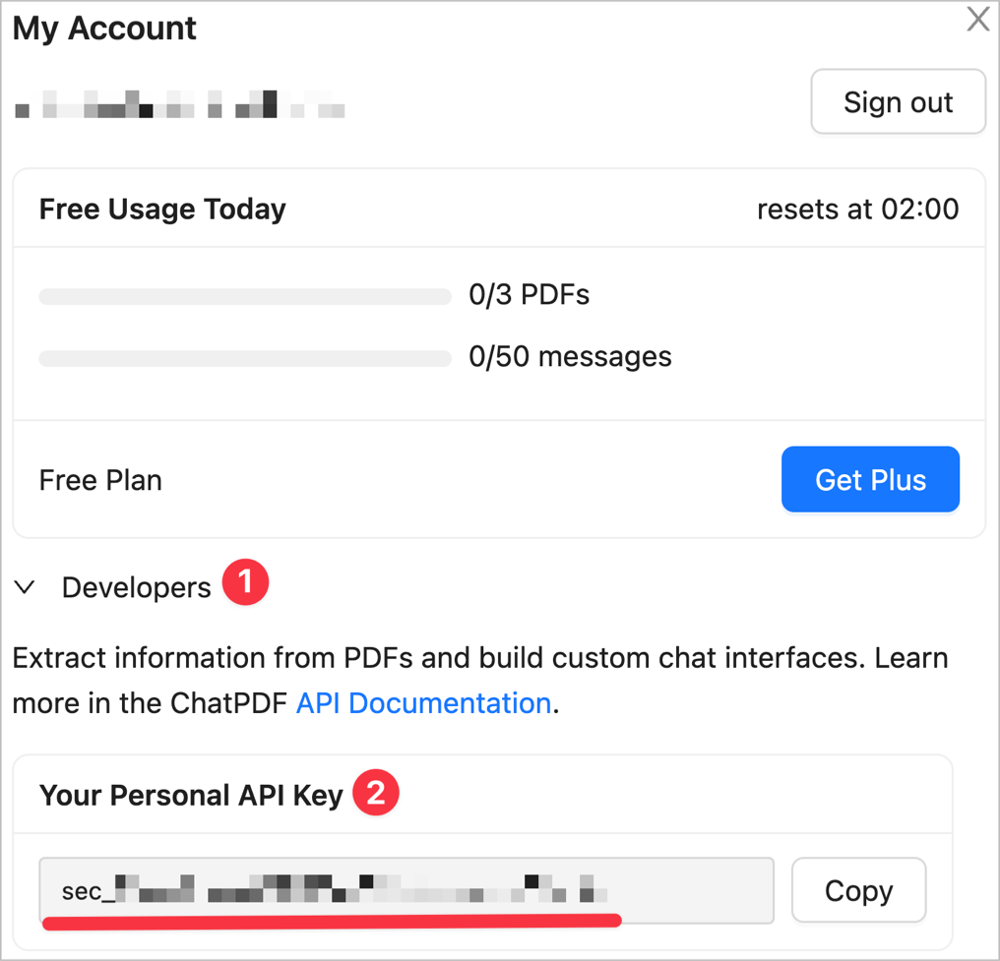

 <!-- LTeX: disabled=true -->
# PDF summarizer for Alfred<!-- LTeX: enabled=true -->

Get summaries of your PDFs via [ChatPDF](https://www.chatpdf.com/) with just one
hotkey.

Requires a ChatPDF API key, which is (currently) free for 5000 PDF pages / 500
requests per month.

## Installation & Setup
[➡️ Download the latest release.](./releases/latest)

The workflow auto-updates via Alfred's workflow-update mechanism.

**Get a ChatPDF API key:**
1. Go to <https://www.chatpdf.com/>
2. Scroll to the bottom of the page.
3. In the footer, click `My Account`. You are prompted to create an account if
   you do not have one yet.
4. In `My Account`, expand the `Developer` settings. You can find your API key there:

> [!NOTE]
> **Advanced Users:** Instead of entering the API key directly, you can also
> enter `.zshenv` into the API key field. The workflow then uses the key
> exported as `CHATPDF_API_KEY` in your `.zshenv`.
